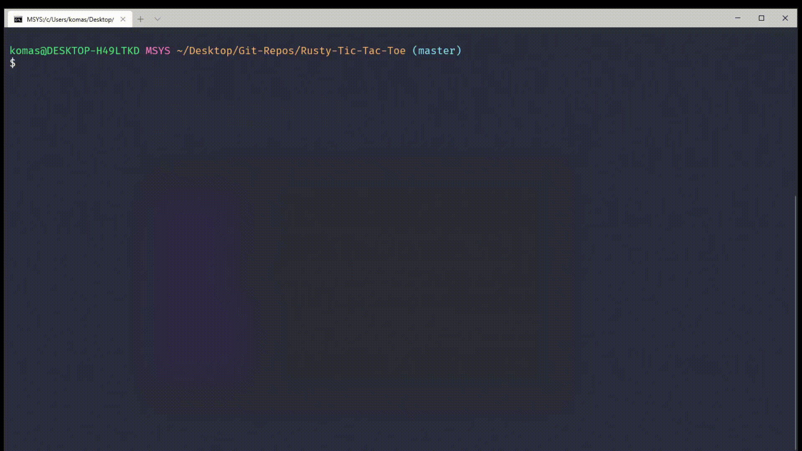

# Rusty Tic Tac Toe

A fully working Tic Tac Toe game in Rust.

> Python version of this code: [link](https://github.com/PranavB6/unbeatable-tic-tac-toe)

# Demo

# How to Run

1. Install Rust
2. [Download](https://github.com/PranavB6/Rusty-Tic-Tac-Toe/archive/master.zip) the code
3. From the project directory, Run the command: `cargo run`
   1. Or Run: `cargo run --release` for optimized version
4. Play the game!

# Features

* Human vs Human mode
* Human vs Bot mode
* Easy, Medium and Impossible Bot levels
* The Bot implements the minimax algorithm to decide the best possible move

# Resources
* If you haven't already checked it out, [The Rust Book](https://doc.rust-lang.org/book/) is an excellent resource 

# Note
* Please let me know if there's any problems or if you have any questions about the code

